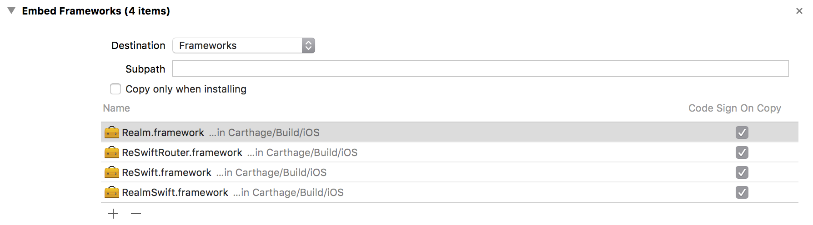

[](https://travis-ci.org/avdyushin/UDF_Swift)

# State management in iOS

## Introduction

In iOS development it's always good to choose a right architecture.
As you know in projects that are using `MVC` pattern it becomes hard
to maintain and test massive view controller after some time.

Let's try to make it more clean and reusable using unidirectional data flow architecture.

### Unidirectional Data Flow pattern

Main aspects:

* The whole application `state` is stored in single object (store)
* The only way to change the `state` is to trigger (dispatch) an `action` (an object describing what to do)
* `Reducer` specifies how to generate new `state` based on given `action` and current `state`.

That's basically it.

In this tutorial you will see how to build sample iOS application
using `ReSwift` framework that provides unidirectional data flow pattern implementation.

## About application

We are going to build simple application that allows users track their frequently collected data.
It could be let's say mileage each month or outcome per day.

The main screen (overview) is the place where users can view all created project,
sorted by updated date and create new projects.
Swipe action on the cell allows to edit or delete existing projects.

Project details screen will display all items related to given project with possibility to manage it.


## Architecture description

Using `ReSwift` which is an implementation of the unidirectional data flow in Swift,
we will separate our project into components:

* Application state, explicitly stored in a data structure
* Views, just a visualization of the current state of the application
* State changes, using actions to perform it
* Realm database to persist user's data


## Getting Started

First of all we need to setup all dependencies for the project.
One way to install `ReSwift` and `Realm` is using `Carthage` dependency manager for Cocoa applications.
Carthage can be installed using `brew install carthage` command or downloading `.pkg` from it's home page.

*NOTE* this tutorial was written using latest version of `Swift 4.0.2`, `ReSwift 4.0.0` and `Realm 3.0.2`.

Create a file called `Cartfile` in the root directory of you project.
(Could be done in Terminal using `cat > Cartfile` insert following text then type `^D`).

```sh
github "ReSwift/ReSwift"
github "ReSwift/ReSwift-Router"
github "realm/realm-cocoa"
```

After saving `Cartfile` run this command from Terminal inside root directory of your project.
```sh
carthage bootstrap --cache-builds --platform iOS
```

This will fetch all dependencies and build or download pre-compiled framework.
They could be found in `Carthage/Checkouts` folder.
Then in your application targets' `General` settings tab open `Embedded Binaries` section
and drag-n-drop each framework from `Carthage/Build`.
Next in `Build Phases` tab check `Embedded Framework` section to contain all your frameworks.



## Uni-direction Data Flow basics

### State

As we said we need to create an application state.
In main state we will keep navigation state, all projects list as `Results<Project>` and `Realm` itself:

```swift
class MainState: NSObject, StateType, HasNavigationState {
    var navigationState: NavigationState
    var projects: Results<Project>
    let realm = try! Realm()

    init(navigationState: NavigationState = NavigationState()) {
        self.projects = realm.objects(Project.self).sorted(byKeyPath: "updatedAt", ascending: false)
        self.navigationState = navigationState
    }

    static var `default` = MainState()
}
```

Because it's demo project for simplify let's store the state as a static variable inside `AppDelegate.swift`:

```swift
static let AppDelegate.projectsStore = Store<MainState>(reducer: Reducer.reduce, state: MainState.default)
```

### Actions

To make changes on the state we need to create actions.
There are main actions to manage project and items:

* Create new one
* Update existing
* Delete existing

### Projects actions:

```swift
/// Project actions
enum ProjectActions: Action {
    /// Creates new `Project` with given title, frequency and units
    case create(title: String, frequency: Project.Frequency, units: String)
    /// Updates given `Project` with new title, frequency and units
    case update(Project, newTitle: String, newFrequency: Project.Frequency, newUnits: String)
    /// Deletes given `Project`
    case delete(Project)
}
```

### Items actions:

```swift
/// Item actions
enum ItemActions: Action {
    /// Creates new `Item` in parent `Project` with given amount, timestamp and notes
    case create(parent: Project, amount: Double, timestamp: Date, notes: String?)
    /// Updates given `Item` with new amount, timestamp and notes
    /// Parent `Project` is needed to change `updatedAt` date
    case update(Item, parent: Project, newAmount: Double, newTimestamp: Date, newNotes: String?)
    /// Deletes given `Item`
    /// Parent `Project` is needed to change `updatedAt` date
    case delete(Item, parent: Project)
}
```

They are similar but for create new `Item` we need to pass parent `Project` object to link items.
For update or delete items parent project is used for update changed date.

### Reducers

Reduces — functions to create new state based on given state.
This functions will accept action and current state and return new state after processing an action.
First of all we need to handle navigation action and then other actions.

```swift
struct Reducer {
    // Main reducer
    static func reduce(action: Action, state: MainState?) -> MainState {
        let state = state ?? MainState()
        state.navigationState = NavigationReducer.handleAction(action, state: state.navigationState)

        switch action {
        case let action as ProjectActions:
            ProjectReducer.reduce(action, state: state)
        case let action as ItemActions:
            ItemReducer.reduce(action, state: state)
        default:
            ()
        }

        return state
    }
}
```

### Project reducer

As we used `enum` for actions it is easy to switch over types of action to check what to do:

```swift
struct ProjectReducer {
    // Handle project actions
    static func reduce(_ action: ProjectActions, state: MainState) {
        switch action {
        case .create(let title, let frequency, let units):
            try! state.realm.write {
                let project = Project()
                state.realm.add(project)
                project.title = title
                project.frequency = frequency
                project.units = units
            }
        case .update(let project, let newTitle, let newFrequence, let newUnits):
            try! state.realm.write {
                project.title = newTitle
                project.frequency = newFrequence
                project.units = newUnits
            }
        case .delete(let project):
            try! state.realm.write {
                state.realm.delete(project)
            }
        }
    }
}
```

### Item reducer

```swift
struct ItemReducer {
    // Handle project's items actions
    static func reduce(_ action: ItemActions, state: MainState) {
        switch action {
        case .create(let project, let amount, let timestamp, let notes):
            try! state.realm.write {
                let item = Item()
                state.realm.add(item)
                item.amount = amount
                item.timestampValue = timestamp
                item.comment = notes
                project.items.append(item)
                project.updatedAt = Date()
            }
        case .update(let item, let project, let newAmount, let newTimestamp, let newNotes):
            try! state.realm.write {
                item.amount = newAmount
                item.timestampValue = newTimestamp
                item.comment = newNotes
                project.updatedAt = Date()
            }
        case .delete(let item):
            try! state.realm.write {
                state.realm.delete(item)
            }
        }
    }
}
```

## Subscription to state changes

In order to listen state changes let our view to confirm `StoreSubscriber` protocol first:

```swift
extension ProjectViewController: StoreSubscriber {
    func newState(state: MainState) {
        // New state changes
    }
}
```

To be begin receive updates we should subscribe listener:

```swift
override func viewWillAppear(_ animated: Bool) {
    super.viewWillAppear(animated)
    AppDelegate.projectsStore.subscribe(self)
}
```

And do not forget to unsubscribe listener when we are done:

```swift
override func viewDidDisappear(_ animated: Bool) {
    super.viewDidDisappear(animated)
    AppDelegate.projectsStore.unsubscribe(self)
}
```

## Navigation State

Navigation over different screens will be done with dispatching routing actions,
for this one we need to create main `Router` and define how routes should be handled for different route paths.

Let's show main view controller right after application started:

```swift
var router: Router<MainState>!
let mainRouter = HomeViewRouter(window: window!)
router = Router(store: AppDelegate.projectsStore, rootRoutable: mainRouter) {
    $0.select { $0.navigationState }
}

AppDelegate.projectsStore.dispatch(SetRouteAction([RouteIdentifiers.HomeViewController.rawValue]))
```

### Home screen routes

```swift
/// Home screen
struct HomeViewRouter: Routable {
    let window: UIWindow
    let storyboard = UIStoryboard(name: "Main", bundle: nil)

    private func setToViewController(_ viewController: UIViewController) -> Routable {
        let nav = UINavigationController(rootViewController: viewController)
        self.window.rootViewController = nav
        return self
    }

    func pushRouteSegment(_ routeElementIdentifier: RouteElementIdentifier,
                          animated: Bool,
                          completionHandler: @escaping RoutingCompletionHandler) -> Routable {
        // Action on push new route segment
    }

    func popRouteSegment(_ routeElementIdentifier: RouteElementIdentifier,
                         animated: Bool,
                         completionHandler: @escaping RoutingCompletionHandler) {
        // Action on pop given route segment
    }

    func changeRouteSegment(_ from: RouteElementIdentifier,
                            to: RouteElementIdentifier,
                            animated: Bool,
                            completionHandler: @escaping RoutingCompletionHandler) -> Routable {
        // Action on change from one into another route segment
    }
}
```

Implementing `pushRouteSegment` we will decide how to show given route segment.
In case of add new project we need to show modal view controller,
but in case of project details we need to push it into current navigation stack.

```swift
func pushRouteSegment(_ routeElementIdentifier: RouteElementIdentifier,
                      animated: Bool,
                      completionHandler: @escaping RoutingCompletionHandler) -> Routable {

    let viewController = storyboard.instantiateViewController(withIdentifier: routeElementIdentifier)
    switch routeElementIdentifier {
    case RouteIdentifiers.HomeViewController.rawValue:
        completionHandler()
        return setToViewController(viewController)
    case RouteIdentifiers.AddProjectViewController.rawValue:
        let nav = UINavigationController(rootViewController: viewController)
        self.window.rootViewController?.present(nav, animated: true, completion: completionHandler)
        return self
    case RouteIdentifiers.ProjectViewController.rawValue:
        if let nav = self.window.rootViewController as? UINavigationController {
            nav.pushViewController(viewController, animated: animated)
        }
        completionHandler()
        return ProjectRouter(viewController: viewController)
    default: ()
    }

    assert(false, "Push route `\(routeElementIdentifier)` not found!")
}
```

Inside `popRouteSegment` we will dismiss modal view controllers or
do nothing if it was pop from navigation stack.

```swift
func popRouteSegment(_ routeElementIdentifier: RouteElementIdentifier,
                     animated: Bool,
                     completionHandler: @escaping RoutingCompletionHandler) {

    switch routeElementIdentifier {
    case RouteIdentifiers.AddProjectViewController.rawValue,
         RouteIdentifiers.AddItemViewController.rawValue:
        self.window.rootViewController?.presentedViewController?.dismiss(animated: true, completion: completionHandler)
        return
    case RouteIdentifiers.ProjectViewController.rawValue:
        completionHandler()
        return
    default: ()
    }

    assert(false, "Pop route `\(routeElementIdentifier)` not found!")
}
```

You can see that `changeRouteSegment` used for initial state, when home screen is set.
It just sets root view controller for application's window.

```swift
func changeRouteSegment(_ from: RouteElementIdentifier,
                        to: RouteElementIdentifier,
                        animated: Bool,
                        completionHandler: @escaping RoutingCompletionHandler) -> Routable {

    let viewController = storyboard.instantiateViewController(withIdentifier: to)
    return setToViewController(viewController)
}
```

### Go to route and passing data between view controllers

To apply new route for the application first of all we need to create new routes array:

```swift
let routes: [RouteElementIdentifier] = [
    RouteIdentifiers.HomeViewController.rawValue,
    RouteIdentifiers.ProjectViewController.rawValue
]
```

And then `SetRouteAction` to be dispatched later:

```swift
let routeAction = SetRouteAction(routes)
```

To pass some data into route let's create `SetRouteSpecificData` object
with our `routes` and the data we want to pass to (for ex. `Project` object instance):

```swift
let project = AppDelegate.projectsStore.state.projects[indexPath.row]
let setDataAction = SetRouteSpecificData(route: routes, data: project)
```

Now we can do dispatch of the route and the route data actions:

```swift
AppDelegate.projectsStore.dispatch(setDataAction)
AppDelegate.projectsStore.dispatch(routeAction)
```

That it to change application state into new route
which will be push project details view controller into current navigation stack
as we set it up in `HomeRouter` object.

### Getting data from router

To receive data from router in our `newState` method we should ask `navigationState` to get data:

```swift
func newState(state: MainState) {
    if let project: Project = state.navigationState.getRouteSpecificState(state.navigationState.route) {
        self.project = project
    }
}
```

## Persist data

The main Realm differences from other data base library — is live objects, which are automatically updated.
To define model you just need to create a logical model class, sub classing `Object` class.
In our sample project we need only two models: `Project` and `Item` with one-to-many relationship.

### Project and Item models

```swift
class Project: Object {
    enum Frequency: Int {
        case daily = 0, monthly, yearly
    }

    var frequency: Frequency {
        get {
            return Frequency(rawValue: frequencyRaw)!
        }
        set {
            frequencyRaw = newValue.rawValue
        }
    }

    @objc dynamic var id = UUID().uuidString
    @objc dynamic var title = ""
    @objc dynamic var units = ""
    @objc dynamic var createdAt = Date()
    @objc dynamic var updatedAt = Date()
    @objc private dynamic var frequencyRaw = 0
    let items = List<Item>()
}
```

In order to store `enums` inside Realm object we need to make a private dynamic property,
which will be store raw value of the `enum`. And then create calculated property for `enum` itself.

```swift
class Item: Object {
    @objc dynamic var id = UUID().uuidString
    @objc dynamic var amount = -1.0
    @objc dynamic var timestamp = Date()
    @objc dynamic var comment: String?
    @objc dynamic var sectionKey = ""
}
```

### Creating projects

When user adds a new project, he will has a change to enter name and units and select frequency.
To create available frequencies list and make it's string representation we can extend `Frequency` `enum`:

```swift
extension Frequency: CustomStringConvertible {
    static var all = [Frequency.daily, Frequency.monthly, Frequency.yearly]
    var description: String {
        switch self {
        case .daily: return "Daily"
        case .monthly: return "Monthly"
        case .yearly: return "Yearly"
        }
    }
}
```

### Adding new objects

In order to create new `Project` object we will dispatch action `ProjectActions.create`
with specific parameters.
This action will be handled by our main reducer where we will create new objects in realm database.

### Changing and removing existing objects

The same as with creation, but dispatch different action: `ProjectActions.update`.
For removing use action: `ProjectActions.delete`

## Update view on data changes

We can subscribe to object changes to update our view to latest state:

```swift
notificationToken = AppDelegate.projectsStore.state.projects.observe { changes in
    switch changes {
    case .initial:
        self.tableView.reloadData()
    case .update(_, let deletions, let insertions, let modifications):
        self.tableView.beginUpdates()
        self.tableView.insertRows(at: insertions.map {IndexPath(row: $0, section: 0)}, with: .automatic)
        self.tableView.reloadRows(at: modifications.map {IndexPath(row: $0, section: 0)}, with: .automatic)
        self.tableView.deleteRows(at: deletions.map {IndexPath(row: $0, section: 0)}, with: .automatic)
        self.tableView.endUpdates()
    default:
        ()
    }
}
```

And unsubscribe later:

```swift
notificationToken?.invalidate()
```

## Conclusion

Now we have very simple view controllers which update itself depending on state
and send actions in order to change state.

It doesn't do any navigation actions and storage in database.
For more code samples it's good to view sources and run sample project.

## Bonus

Travis CI configuration:

```yaml
language: swift
osx_image: xcode9.1

cache:
    directories:
        - Carthage

before_script:
    - brew update
    - brew outdated carthage || brew upgrade carthage
    - carthage bootstrap --platform iOS --cache-builds --verbose

script:
    - set -o pipefail
    - xcodebuild -project UDF_Swift.xcodeproj -sdk iphonesimulator ONLY_ACTIVE_ARCH=NO | xcpretty -c
```

## Links

- [Carthage](https://github.com/Carthage/Carthage)
- [ReSwift](https://github.com/ReSwift/ReSwift)
- [ReSwift Router](https://github.com/ReSwift/ReSwift-Router)
- [Realm](https://realm.io)
